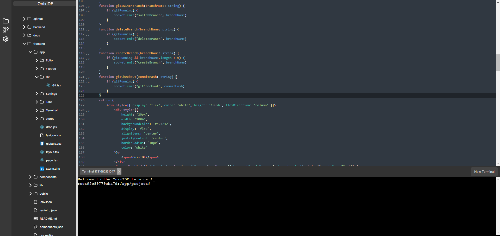

# OnixIDE



<div align="center">
  <a href="https://github.com/ExoOnix/OnixIDE">
    
  </a>
  <a href="https://github.com/ExoOnix/OnixIDE/fork">
    
  </a>
  <a href="https://github.com/ExoOnix/OnixIDE/issues">
    
  </a>
<a href="https://opensource.org/license/mit">
  
</a>
</div>

OnixIDE is a powerful collaborative online IDE built with Node.js, designed for real-time file synchronization via WebSockets. It's a environment perfect for basic collaborative projects.

### Key Features

- **Advanced Code Editor**: Utilizes [CodeMirror 6](https://codemirror.net/6/) for a rich text-editing experience with syntax highlighting, autocompletion, and more.
- **Dynamic File Tree**: Supports drag-and-drop file uploads, making it easier to manage project files.
- **Built-in Terminal**: Execute commands directly within the IDE without leaving the interface.
- **Real-time Collaboration**: Work with multiple users simultaneously on the same files with seamless updates and synchronization.
- **Fully online**: Runs entirely in your browser.
- **Draggable panels**: Drag panels for better visibility.
---

### Roadmap(Subject to change)

- [x] File watching for external edits
- [x] File tree icons + Language support
- [x] Multiple terminal tabs
- [ ] AI autocomplete 
- [ ] Git integration
- [ ] Synchronized cursors and selections


## Local Development Setup
The code has gone through a lot of rewrites and changes, so it might be a bit messy in places, but it works.
To get started with local development:

### Backend:

> **Note**: The folder open in the IDE is backend/project.


1. Navigate to the backend directory:

   ```bash
   cd backend
   ```

2. Install dependencies:

   ```bash
   yarn
   ```

3. Start the development server:

   ```bash
   yarn dev
   ```

### Frontend:

1. Navigate to the frontend directory:

   ```bash
   cd frontend
   ```

2. Install dependencies:

   ```bash
   yarn
   ```

3. Start the frontend server:

   ```bash
   yarn dev
   ```

> **Note**: Run both servers (frontend and backend) in separate terminal windows. Once running, open the IDE on `http://localhost:3000`.

---

## Production Build

For production deployment, follow these steps:

1. Export environment variables(Set them aswell.):

   ```bash
   export $(grep -v '^#' .env | xargs)
   ```

2. Build and run the application using Docker Compose:

   ```bash
   docker compose up --build
   ```

This will launch the application with all required services in a production-ready environment.

---

## License & Usage

MIT License
